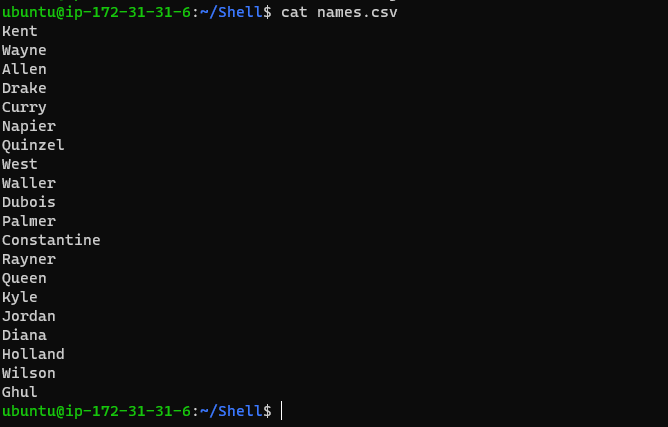
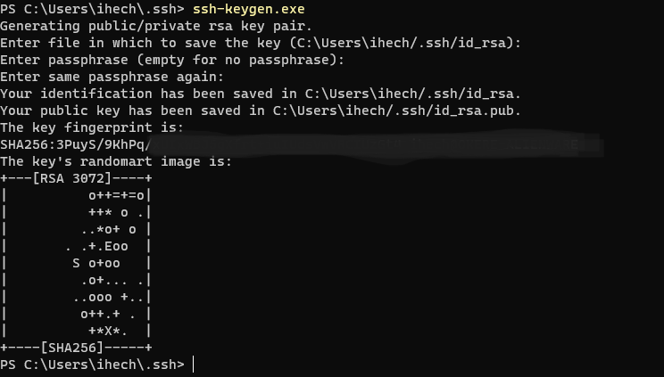
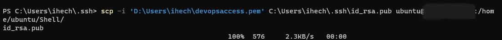
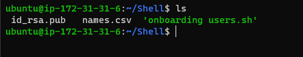
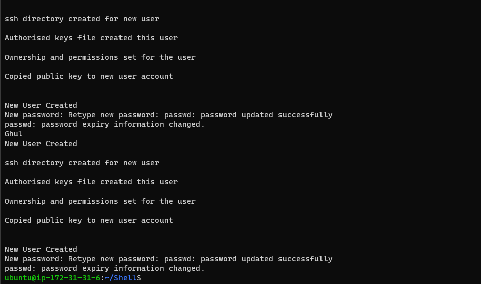
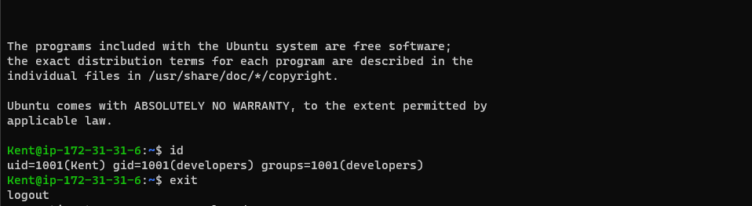
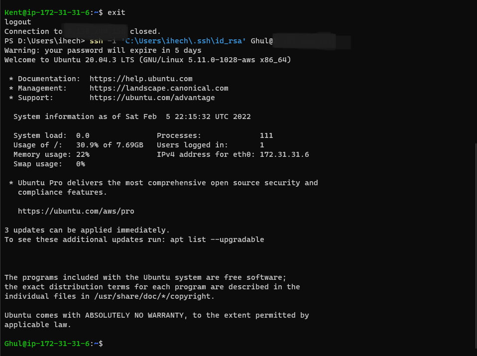

# Auxillary Project

## Shell Scripting (Automatically onboarding Users)

Summary:Shell scripting refers the chaining of commands into a script for execution through a shell.
Anthing from a single command or a series of command to be executed by the shell through scripts.
In this project, an admin will create a script to onboard a list of 20 users on to a system by creating 
a group for the users called "developers", creatin user accounts for the users with home directories for each user,
creating access to the user accounts using ssh key and setting a default password that expires on 5 logins.

Firstly, the remote server was updated 
 ```bash
 sudo apt update && sudo apt upgrade
 ```
 A directory was created to contain the script and the files needed by the script.
 Then the files were created, the first was the names.csv which contained the names of the users to be onboarded
     

 Below is the list of the names in the file. Which happens to be the names of the list of users we want to onboard on to the system.
   

 The other file that was needed is a public key from the administrative computer, this was obtained by generating a key pair on the administrative machine with the 
 command below:
    

After the key pair generation, the public key was copied over to the remote server using the following command
   

Accessing the directory on the server shows the file was copied over:
   


 The script `onboarding users.sh` which can be found in the corresponding project code folder of this project name was written with instructions to 
 confirm the script was only to be run from a privileged account, create a group called `deverlopers`, create a new user for each name in the `names.csv` file,
 create a directory for ssh on the new user accounts, copy the admin public key to the authorized_keys file in the ssh folder and set a password which was to expire
 after 5 logins.

 The script was run successfully and accounts were created for  all the users in the `names.csv` file. 
   

For further confirmation, some of the accounts were logged into. A look at the pictures below
   
   
 
 NB: It was quite easy to make minor mistakes during the deployment of the script, to remedy this, I created a script `offboarding.sh` to undo mistakes that could occur
 while onboarding users through the script.