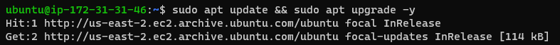
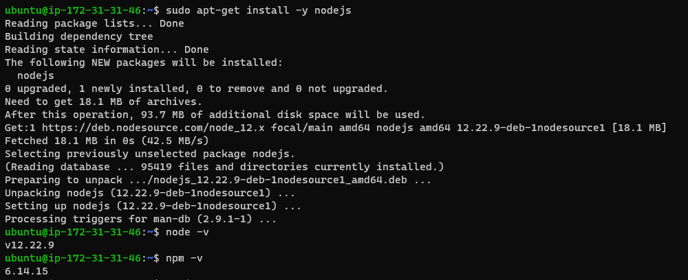
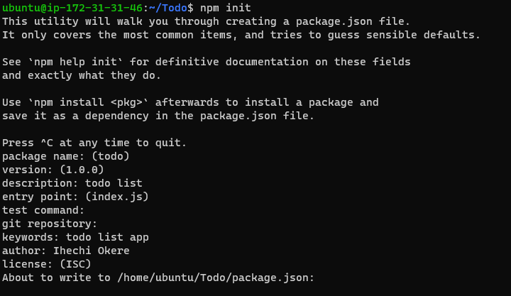

# Project 3

## MERN Stack Implementation

Summary: MERN stack refers to a technology stack that consists of MongoDB, Express, React and Node.js. 
These technologies put together give developers who are well versed in Javascript a uniform stack to deploy full stack applications based on Javascript.
The project was hosted on AWS cloud. On an Ubuntu 20.04 lts Linux instance.

As always, a system update was first applied 


* Setting up the backend
Firstly, the backend was setup. The NodeSource Node.js 12.x repo was installed using the following command:
```bash
curl -sL https://deb.nodesource.com/setup_12.x | sudo -E bash -
```
After which	`node.js` was installed



With `node.js and `npm` installed, a directory was created to house the project and a repo was initialiased to start the project
```bash
npm init
```



The next component to be installed was Express

```bash
npm install express
```


