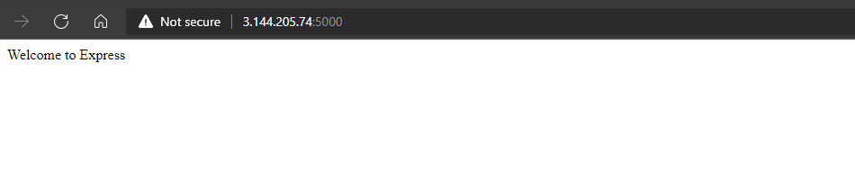

# Project 3

## MERN Stack Implementation

Summary: MERN stack refers to a technology stack that consists of MongoDB, Express, React and Node.js. 
These technologies put together give developers who are well versed in Javascript a uniform stack to deploy full stack applications based on Javascript.
On this project, a simple todo list app was created.
The project was hosted on AWS cloud. On an Ubuntu 20.04 lts Linux instance.

As always, a system update was first applied 


* Setting up the backend
Firstly, the backend was setup. The NodeSource Node.js 12.x repo was installed using the following command:
```bash
curl -sL https://deb.nodesource.com/setup_12.x | sudo -E bash -
```
After which	`node.js` was installed


With `node` and `npm` installed, a directory was created to house the project and a repo was initialiased to start the project
```bash
npm init
```


The next component to be installed was Express

```bash
npm install express
```
a module `dotenv` was installed to help load environment variables
```bash
npm install dotenv
```
and the a file was created `index.js` to host our javascript code which will be used to launch our express server
you can view the code snippet below to see what the file contains:


Running the javascript file started the express server on port 5000
```bash
node index.js
```

Accessing through a web browser shows the webpage being served on that port:



Our todo list application is expected to have three (3) functionalities.  
Each functionality would need to be associated with a particular endpoint. we would creates to the various endpoints required for the project.

We started this by creating a model which will be used to define our database schema
this was made easier by installing `mongoose`
```bash
npm install mongoose
```
the schema file `todo.js` was created in models folder which was created for the aformentioned purpose


the next step is to create the routing


For this project, we used a cloud-based instance of mongodb from [MongoDB](https://cloud.mongodb.com/). An account was created, then a cluster was created
and the access list was set to anywhere(this is not recommended for a production environment).


If you paid attention in the index.js file, we specified a process .env to access environment variables even without creating the file. The file was created and 
filled with the following code snippet:


Then it was time to connect to our database, the code used for the connect was put in the 'index.js' file used to launch Express
a few steps before, below is the content:


Performed a series of operations to test the backend through an api using Postman:

First was a GET operation:


Then a POST operation:


And a DELETE operation:


* Front-end Development
In the application directory the command `npx create-react-app client` to initiate the creation of a react app named client.
But an error was encountered because the version of Node installed was obselete. 


So Node was updated with the commands shown below:


After running the update, the creation of the react app worked like a charm:


Before running the newly created react app, some dependencies had to be installed `concurrntly` and `nodemon`
to run more than one command simultaneously from the same terminal window and monitor the server for changes and reload respectively.
```bash
npm install concurrently --save-dev
npm install nodemon --save-dev
```

Then we headed back into the Todo folder to edit the `package.json` file with the following snippet:
```json
"scripts": {
"start": "node index.js",
"start-watch": "nodemon index.js",
"dev": "concurrently \"npm run start-watch\" \"cd client && npm start\""
},
```


We headed over the same file `package.json` in the client dirctory to add
a key value pair in the file which will enable access through a web browser via `http://localhost:5000` 
instead of `http://localhost:5000/api/todos`.


To confirm it worked we ran `npm run dev` in the Todo directory. And it started the server on port 3000 on the localhost as seen below:


React uses components to make code reusable, similar to classes and functions in some other programming languages.
For this Todo app, there will be two stateful components and one stateless component.
The 3 files used for this were created in a new directory `Todo/client/src/components`
the files are `Input.js` `ListTodo.js` `Todo.js`.
The codes contained in these files can be viewed in the corresponding project name under the code directory in this repository

One final dependency was installed `axios`. It lets you make use of asynchronous readable code present in Javascript.

The following apps were edited in the `Todo/src` directory `App.js` `App.css` `index.css` 


The command to run the application was run in the Todo folder
```bash
npm run dev
```
and viola!!


