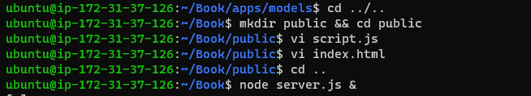

# Project 4

## MEAN Stack Implementation

Summary: The MEAN stack refers to web technology stack used to build web based application from the back-end to the front-end with Javascript.
MEAN stands for MongoDB, Express.js, AngularJS and Node.js


* ### Installing NodeJS
As is customary, we started by running a system update:
```bash
sudo apt update && sudo apt upgrade -y
```

Next, I added a few packages for certificate management and added the repository to dowload and install Node.
```bash
sudo apt -y install dirmngr apt-transport-https lsb-release ca-certificates```
```bash
curl -sL https://deb.nodesource.com/setup_12.x | sudo -E bash -
```
NodeJS installation 
```bash
sudo apt install -y nodejs
```


* ### Installing MongoDB
Similarly, as in the previous step, the key and repository were added
```bash
sudo apt-key adv --keyserver hkp://keyserver.ubuntu.com:80 --recv 0C49F3730359A14518585931BC711F9BA15703C6
```
```bash
echo "deb [ arch=amd64 ] https://repo.mongodb.org/apt/ubuntu trusty/mongodb-org/3.4 multiverse" | sudo tee /etc/apt/sources.list.d/mongodb-org-3.4.list
```
Then install the MongoDB package
```bash
sudo apt install -y mongodb
```
Started the service:
```bash
sudo service mongodb start
```
checked the status of the service:
```bash
sudo systemctl status mongodb
```


Now it's time to install body-parser package using npm:
```bash
sudo systemctl status mongodb
```
The folder books was created and used to host the files required for the project.
The project was initialised and the contents of `server.js` in the code directory was written into the file.
```bash
mkdir Books && cd Books
npm init
vi server.js
```

* ### Installing Express and setting up routes to the server
 
We installed express and mongoose(a package that gives users the ability to mode application data using schemas.
 ```bash
sudo npm install express  mogoose
mkdir apps && cd apps
vi routes.js
```

Then `routes.js` was created to define the routes for Express.
 ```bash
mkdir models && cd models
vi book.js
```


In the `app` folder, We created a folder named `models` and a file named `book.js` in it.
This is where we created the schema definitions for `mongoose`.


 
 back in the Book directory a new folder `public` was created and `script.js` was 
 created in it to host the controller configuration definition alongside an html file `index.html`.
 ```bash
 cd ../..
mkdir public && cd public
vi script.js
vi index.html
cd ..
```


Then we headed back to the `Book` directory to run the `server.js` file with the & sign to run it in the background.
This spawn the server on port 3300 of the machine.
 using curl, you see the contents of the webpage.
 ```bash
node server.js &
```


Accessing port 3300 through a browser shows the website:


