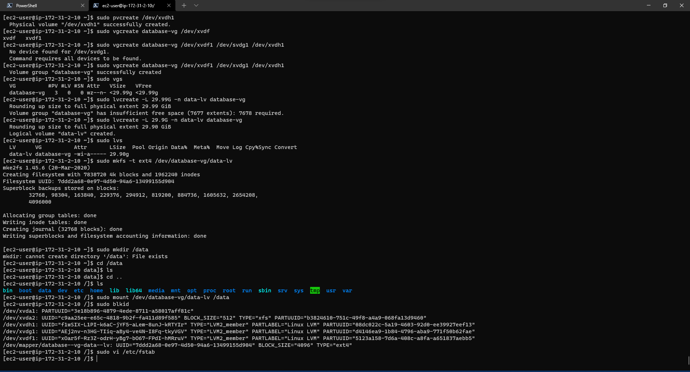

# Project 6

## Web solution with WordPress
Summary: This project shares some similarities with the previous one in the sense that the database 
server used for the previous project had to be connected to remotely. That's as far as similarities go,
This project is aimed at showcasing the three (3) application system used which is commonly used most in production environments.
The three tier application system is a model in application deployment that separates the typically closely-coupled system in different tiers
which handle presentation, application and data. The project will entail the configuration of a storage subsystem for the linux-based database and web servers. Extra EBS volumes will
be attached and formatted for use by the servers. The popular content management system(CMS); Wordpress would be used to handle the application tier while 
A MySQL database would be used to handle the data tier. Two(2) RedHat Linux servers were used for the project.

* Preparing the storage

    * Firstly, the web/application server (Wordpress) was configured:
    Three EBS volumes were created and attached to the server.
    The server was powered on and updated.

    ```bash
    sudo yum update -y
    ```

    The attached disks were confirmed using the command below 
    ```bash
    lsblk
    ```
    Then formatted with the commmand below, to format the partitions to Linux LVM filesystem using `8e00` and the changes to the partition table were written with the `w` option:
    ```bash
    sudo gdisk /dev/xvdf
    sudo gdisk /dev/xvdg
    sudo gdisk /dev/xvdh
    ```
    

    After formatting the partitions, physical volumes were created out of them using the pvcreate utility
    ```bash
    sudo pvcreate /dev/xvdf1 /dev/xvdg1 /dev/xvdh1
    ```
    

    These physical volumes were combined into a volume group called webdata as shown below
    ```bash
    sudo vgcreate webdata-vg /dev/xvdf1 /dev/xvdg1 /dev/xvdh1
      ```
    

    The newly created volume group was split into two (2) to form two (2) equal Logical volumes
    ```bash
        sudo lvcreate -L 14G -n apps-lv webdata-vg
    sudo lvcreate -L 14G -n logs-lv webdata-vg
    sudo pvs
    ```
    

    Both logical volumes were formatted to `ext4` filesystem and mounted for use by the web application
    ```bash
    sudo mkfs -t ext4 /dev/webdata-vg/apps-lv
    sudo mkfs -t ext4 /dev/webdata-vg/logs-lv
    ```

    Directories for the web application and logs were created and the respective logical volumes mounted in them.
    ```bash
    sudo mkdir -p /var/www/html
    sudo mkdir -p /home/recovery/logs
    sudo mount /dev/webdata-vg/apps-lv /var/www/html/
    ```
    The logs directory had to be backed up to before mounting the volume meant for logs to avoid data loss
    then the volume was mounted and files returned back to the directory which is now the mountpoint of the logs volume.
    ```bash
    sudo rsync -av /var/log/. /home/recovery/logs/
    sudo mount /dev/webdata-vg/logs-lv /var/log
    sudo rsync -av /home/recovery/logs/. /var/log
    ```
    The mount points were entered into fstab to achieve persistence on system reboot
    Firstly the `UUID` was obtained using the `blkid` command. 
    ```bash
    sudo blkid
    ```
    

        The mount information were entered into `fstab`.
    ```bash
    sudo vi /etc/fstab
    ```
    

     And the configuration was tested.
    
    ```bash
    sudo mount -a
    sudo systemctl daemon-reload
    ```
    


* Secondly, the database server (MySQL) was configured:
    Three EBS volumes were created and attached to the server.
    The server was powered on and updated.

       The same process carried out on the web server were replicated here.
    A logical volume was created and mounted in `/data' folder. Screenshots  below show a rundown of the full process


    The partitions were formatted.
    

    Details of the partitions created
    

    Tools required for creating the logical volume installed and the logical volume create and mounted
    

    Mount point details entered into fstab for persistence
    


* Setting up the web application and database services on the servers


Install Apache
```bash
sudo yum -y install wget httpd php php-mysqlnd php-fpm php-json

```

Start Apache
```bash
sudo systemctl enable httpd
sudo systemctl start httpd
```

To install PHP and it's dependencies and restart Apache
```bash
sudo yum install https://dl.fedoraproject.org/pub/epel/epel-release-latest-8.noarch.rpm
sudo yum install yum-utils http://rpms.remirepo.net/enterprise/remi-release-8.rpm
sudo yum module list php
sudo yum module reset php
sudo yum module enable php:remi-7.4
sudo yum install php php-opcache php-gd php-curl php-mysqlnd
sudo systemctl start php-fpm
sudo systemctl enable php-fpm
sudo setsebool -P httpd_execmem 1
sudo systemctl restart httpd
```

Wordpress was downloaded and copied over to `/var/www/html`
```bash
 mkdir wordpress
  cd   wordpress
  sudo wget http://wordpress.org/latest.tar.gz
  sudo tar xzvf latest.tar.gz
  sudo rm -rf latest.tar.gz
  cp wordpress/wp-config-sample.php wordpress/wp-config.php
  cp -R wordpress /var/www/html/
```

SELinux policies were configured
```bash
  sudo chown -R apache:apache /var/www/html/wordpress
  sudo chcon -t httpd_sys_rw_content_t /var/www/html/wordpress -R
  sudo setsebool -P httpd_can_network_connect=1
```


On the database server, MySql server was installed


```bash
sudo yum update
sudo yum install mysql-server
```


A database and a user was configured for our remote website 

```bash
sudo mysql
```
```sql
CREATE DATABASE wordpress;
CREATE USER `webuser`@`<Web-Server-Private-IP-Address>` IDENTIFIED BY 'password';
GRANT ALL ON wordpress.* TO 'webuser'@'<Web-Server-Private-IP-Address>';
FLUSH PRIVILEGES;
SHOW DATABASES;
exit
```


Over at the web server, mysql-client was installed to test the connection to the remote DB server
```bash
sudo yum install mysql
sudo mysql -u webuser -p -h <DB-Server-Private-IP-address>
```


Then the wordpress configuration file was edited appropriately to connect to the remote DB.
```bash
sudo vi /var/www/html/wordpress/wp-config.php
```


After editing the configuration file, our wordpress website is available for set up as seen below.

