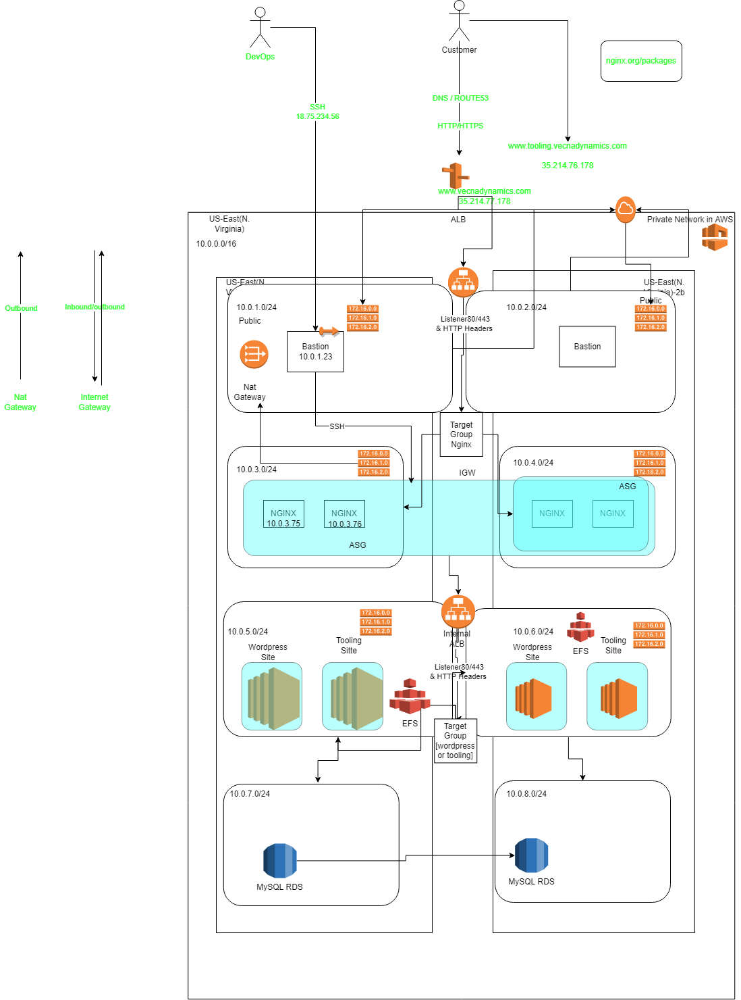
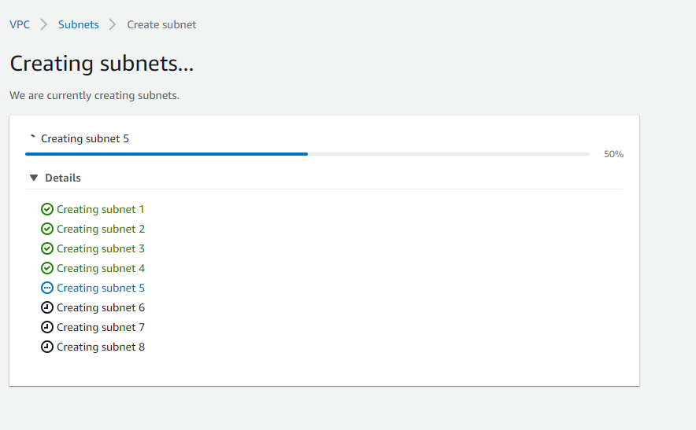
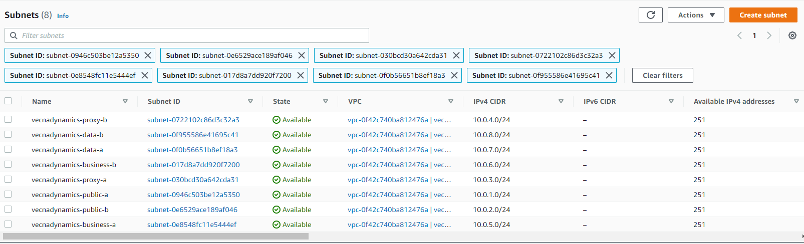
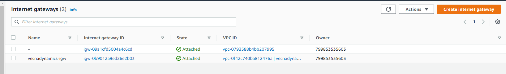
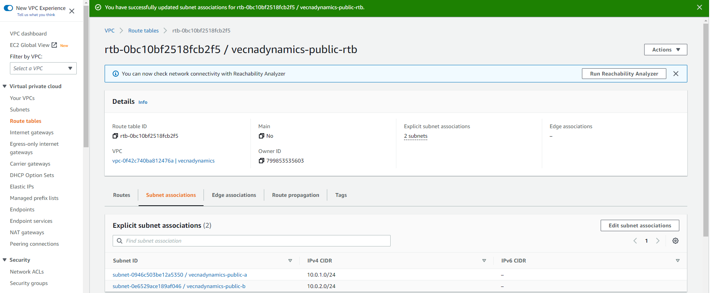
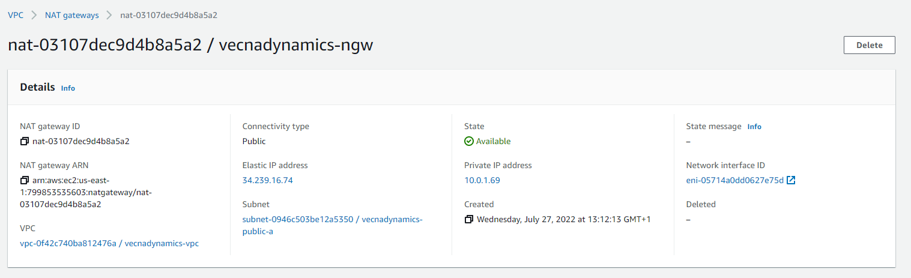
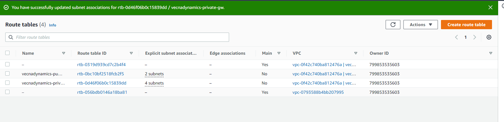

# Project 15

## AWS Cloud solution for 2 Company Websites Using a Reverse Proxy Technology

Summary: This project is aimed at building two websites for a company called Vecna Dynamics (😉). One of the websites would be the main production website and the other would be a tooling website for their devops team.
1 VPC was created for the project

8 subnets were created from the VPC for each tier of the architecture



An internet gateway was created for the VPC

Then a route table was created, added to the two public subnets along with routes to all networks 0.0.0.0/0 to enable routing of traffic between that subnet and the internet.

! A NAT gateway was created and given an elastic ip address for the public subnet to enable resources on the private subnet communicate externally with the internet without the possibility of external resources communicating with the resources.
Note: NAT gateways are expensive so for this scenario only one was deployed to save cost.



Another route table was created for the proxy subnet and the business subnet because they contain resource that would need to pull data using the internet through the nat gateway. This route table will be responsible for routing traffic from the proxy subnets in both availability zones to the internet through the NAT gateway.


The public network requires some level of protection to control who or what has access to the resources placed on that subnet. So a security group was created and attached to the public security group.

Another security group was created for the Application Load Balancer to control inbound traffic to the subnet to just HTTP and HTTPS traffic. And outbound traffic set to all.


A target group was created to manage the distribution of traffic between instances in the auto-scaling group


An application load balancer was created to route between distribute the traffic between targets in the target group.


The next resource that was created was the launch template for the autoscaling group.

The launched template was selected to create used at the creation of the autoscaling group. The external load balancer was added to the ASG


<<<<<<< HEAD
The servers were spun up by changing the desired capacity of the Autoscaling group.

SSH forwarding was used for easier administration of the servers. The public key was added to the ssh-agent running on the host used to connect to our remote servers with the following command.

```bash
ssh-add <publickey.pem>
```

Afterwards, the public server was logged into with the "-A" flag and the key was passed over to subsequent servers.

One of the servers was CentOS 8 which is no longer supported and so there had to be a workaround to update it. Below is the steps for the workaround.

#### Step 1: Go to the /etc/yum.repos.d/ directory.

```bash
cd /etc/yum.repos.d/
```

#### Step 2: Run the below commands

```bash
sed -i 's/mirrorlist/#mirrorlist/g' /etc/yum.repos.d/CentOS-*
sed -i 's|#baseurl=http://mirror.centos.org|baseurl=http://vault.centos.org|g' /etc/yum.repos.d/CentOS-*
```

#### Step 3: Now run the yum update

```bash
yum update -y
```

```bash
#!/bin/bash
cd /etc/yum.repos.d/
sudo sed -i 's/mirrorlist/#mirrorlist/g' /etc/yum.repos.d/CentOS-*
sudo sed -i 's|#baseurl=http://mirror.centos.org|baseurl=http://vault.centos.org|g' /etc/yum.repos.d/CentOS-*
sudo yum update -y
sudo yum install -y nginx git
sudo systemctl restart nginx
sudo systemctl enable nginx
```

sudo yum install -y https://dl.fedoraproject.org/pub/epel/epel-release-latest-7.noarch.rpm

sudo yum install -y dnf-utils http://rpms.remirepo.net/enterprise/remi-release-7.rpm
sudo yum install -y nginx git
sudo systemctl restart nginx
=======
After NGINX is installed on the proxy server, it became accessible through the DNS address of the load balancer.

A hosted zone was created on route 53 with the project name vecnadynamics, and then a record tooling.vecnadynamics.com was created afterwards.

Now to the third layer of the architecture.

Proactively, a security group was created for the subnet hosting the business web servers. Allowing traffic from the Bastion and the internal load balancer.


An internal load balancer was created to route traffic to the web servers hosting the tooling website. Then a target group for the web servers created and linked to the load balancer. And then an Autoscaling group was created to supply the target group EC2 instances.
The internal load balancer was configured with rules to route traffic betewen the main Wordpress website and the tooling website.

A launch template, as well as an Autoscaling group was created for the tooling website and the main wordpress website. With installations of apache web servers installed in the instances.

It was time for the final tier (Data Tier) which handles all our data. Firstly, a security group was created to only accept traffic from the web servers(Wordpress and tooling websites) in the business tier.

A config file `www.tooling.vecnadynamics.com.conf` was created in /etc/nginx/default.d
server {
listen 80;
server_name www.tooling.vecnadynamics.com;
location / {
proxy_pass internal-vecnadynamics-internal-alb-434449287.us-east-1.elb.amazonaws.com;
proxy_set_header Host $host;
}
}


EFS was created for file sharing service of the infrastructure. The file share was mounted on the web servers and the web server files 

efs utils were installed on the clients
```bash
git clone https://github.com/aws/efs-utils
cd efs-utils
sudo yum install -y make rpm-build
make rpm
sudo yum install -y  ./build/amazon-efs-utils*rpm
```

#!/bin/bash

# tooling userdata 

sudo yum update -y
sudo yum install -y mysql git wget 
sudo yum install -y https://dl.fedoraproject.org/pub/epel/epel-release-latest-8.noarch.rpm
sudo yum install -y dnf-utils http://rpms.remirepo.net/enterprise/remi-release-8.rpm


# this section is to install EFS util for mounting to the file system

git clone https://github.com/aws/efs-utils
cd efs-utils
sudo yum install -y make rpm-build
make rpm 
sudo yum install -y  ./build/amazon-efs-utils*rpm

# install botocore - https://docs.aws.amazon.com/efs/latest/ug/install-botocore.html

if [[ "$(python3 -V 2>&1)" =~ ^(Python 3.5.*) ]]; then
    sudo wget https://bootstrap.pypa.io/3.5/get-pip.py -O /tmp/get-pip.py
elif [[ "$(python3 -V 2>&1)" =~ ^(Python 3.4.*) ]]; then
    sudo wget https://bootstrap.pypa.io/3.4/get-pip.py -O /tmp/get-pip.py
else
    sudo wget https://bootstrap.pypa.io/get-pip.py -O /tmp/get-pip.py
fi

sudo python3 /tmp/get-pip.py
sudo pip3 install botocore

# Remember to update the EFS file system ID below
sudo mount -t efs -o tls fs-05b1d7ee92422d438:/ /var/www/html/

sudo mount -t efs -o tls fs-05ac7019200457b56:/ /var/www/html/

sudo mount -t efs -o tls,accesspoint=fsap-0e20bd7d3f6b6630f fs-05ac7019200457b56:/ /var/www/html/


sudo yum install httpd 

sudo systemctl restart httpd

# Configure the tooling app

# Selinux configuration
setsebool -P httpd_can_network_connect=1
setsebool -P httpd_can_network_connect_db=1
setsebool -P httpd_execmem=1
setsebool -P httpd_use_nfs 1


git clone https://github.com/darey-devops/tooling.git
sudo systemctl enable httpd
sudo yum module reset php -y
sudo yum module enable php:remi-7.4 -y
sudo yum install -y php php-common php-mbstring php-opcache php-intl php-xml php-gd php-curl php-mysqlnd php-fpm php-json
sudo systemctl start php-fpm
sudo systemctl enable php-fpm
 cp -R tooling/html/* /var/www/html/

chcon -t httpd_sys_rw_content_t /var/www/html/ -R
systemctl restart httpd

# Update the tooling database
mysql -h acs-database.cdqpbjkethv0.us-east-1.rds.amazonaws.com -u ACSadmin -p toolingdb < tooling-db.sql

sed -i "s/$db = mysqli_connect('mysql.tooling.svc.cluster.local', 'admin', 'admin', 'tooling');/$db = mysqli_connect('acs-database.cdqpbjkethv0.us-east-1.rds.amazonaws.com', 'ACSadmin', 'admin12345', 'toolingdb');/g" functions.php


vi /etc/httpd/conf.d/welcome.conf

<LocationMatch "^/+$">
    Options -Indexes
    ErrorDocument 403 /.noindex.html
</LocationMatch>

<Directory /var/www/html>
    AllowOverride None
    Require all granted
</Directory>

Alias /index.php /var/www/html/index.php

