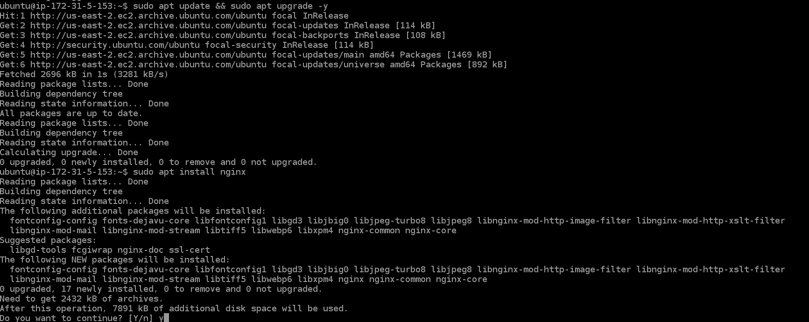
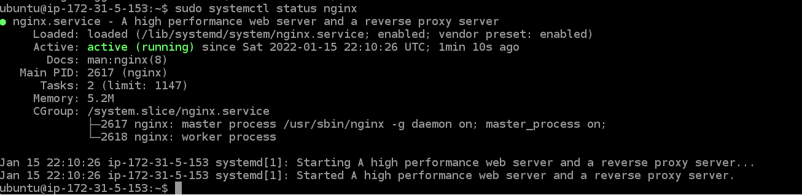
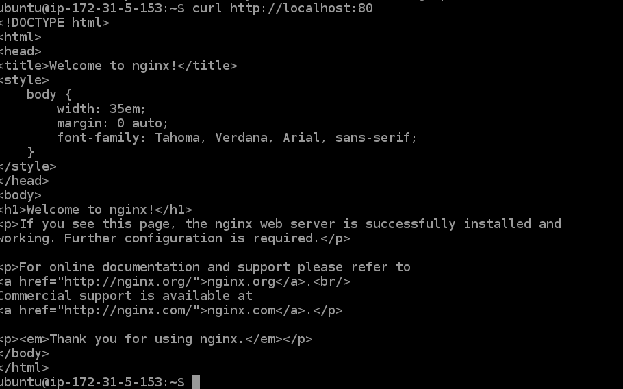
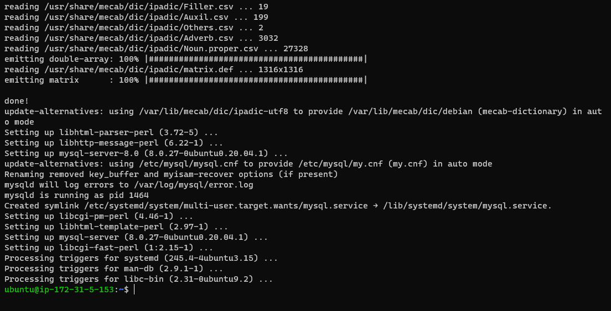
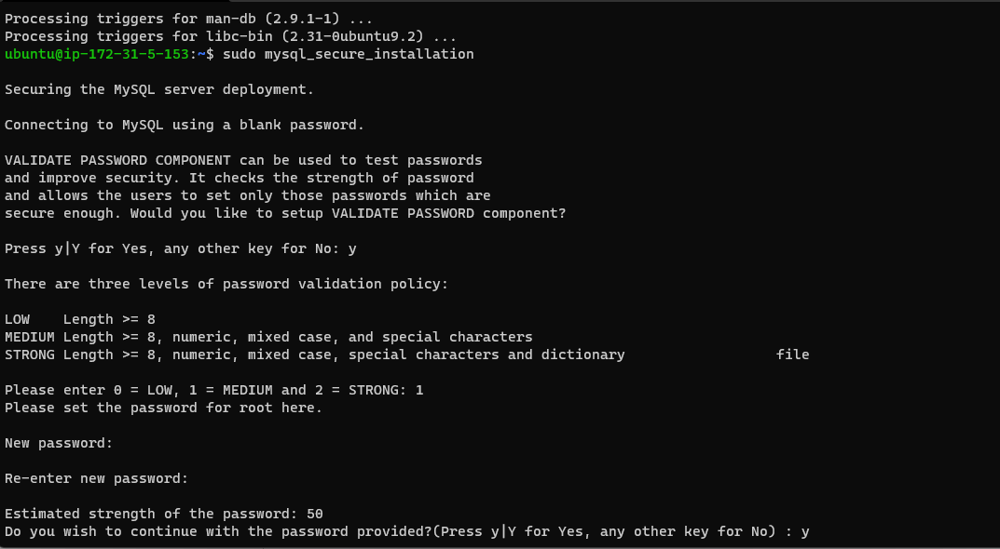

# Project 2

## LEMP Stack Implementation

Summary: In web development, developers have preferences on the technologies they use to achieve their aim. 
While a php based website could be developed with the stack of technologies deployed in the previous project, 
it can also be achieved with a slight variation in the the technologies used. On this project, an NGINX server, a MySQL server and PHP were used. 
The end result was still the same as that of the previous project.
This project was geared towards putting together, the technologies required to build a website using HTML, CSS, PHP and MySQL
The project was hosted on AWS cloud. On an Ubuntu 20.04 lts Linux instance.

* The Linux server was updated and NGINX was installed on it.



Confirmed the web server was running by checking the status of the service:
```bash
sudo systemctl status apache2
```



Also checked to see the websites could be hosted on it by checking what was running on port 80, this showed the default nginx page was running on the port.
```bash
curl http://localhost:80
```


* The next step was to install MySQL server and secure it:
```bash
sudo apt install mysql-server
```




```bash
mysql_secure_installation
```

