 # Project 2

## LEMP Stack Implementation

Summary: In web development, developers have preferences on the technologies they use to achieve their aim. 
While a php based website could be developed with the stack of technologies deployed in the previous project, 
it can also be achieved with a slight variation in the the technologies used. On this project, an NGINX server, a MySQL server and PHP were used. 
The end result was still the same as that of the previous project.
This project was geared towards putting together, the technologies required to build a website using HTML, CSS, PHP and MySQL
To add a little spin to this one, a php script to retrieve data from a MySQL database.
The project was hosted on AWS cloud. On an Ubuntu 20.04 lts Linux instance.

* The Linux server was updated and NGINX was installed on it.

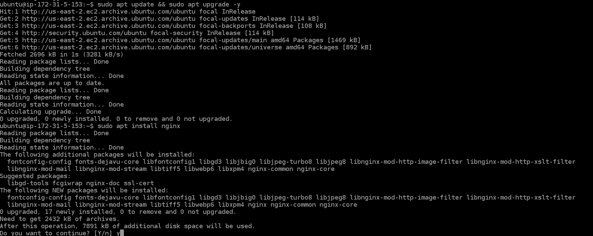

Confirmed the web server was running by checking the status of the service:
```bash
sudo systemctl status apache2
```
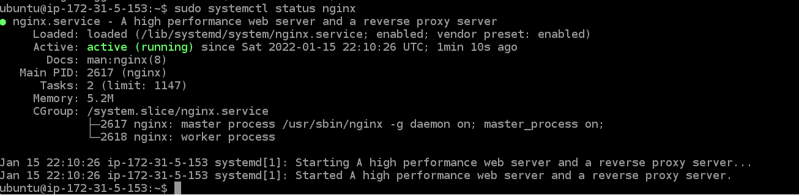


Also checked to see the websites could be hosted on it by checking what was running on port 80, this showed the default nginx page was running on the port.
```bash
curl http://localhost:80
```
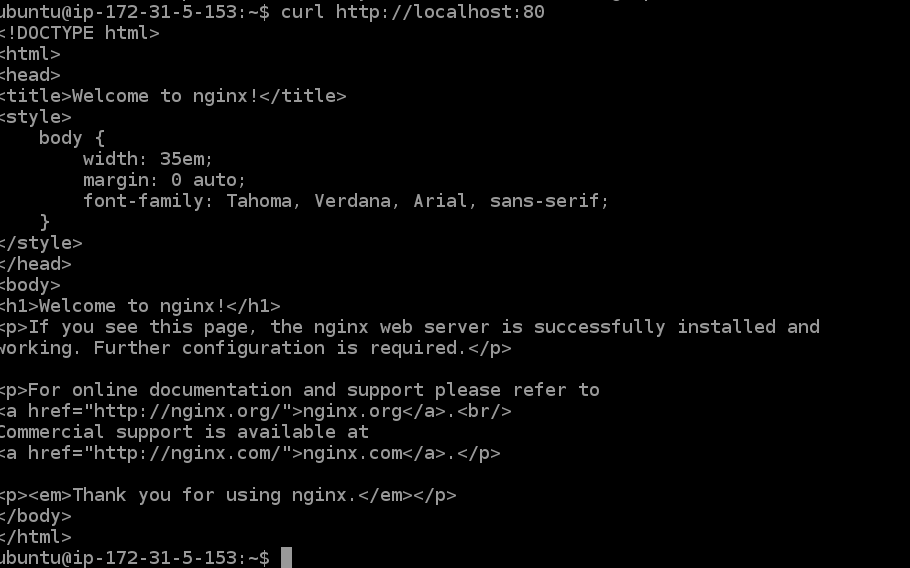

* The next step was to install MySQL server and secure it:
```bash
sudo apt install mysql-server
```

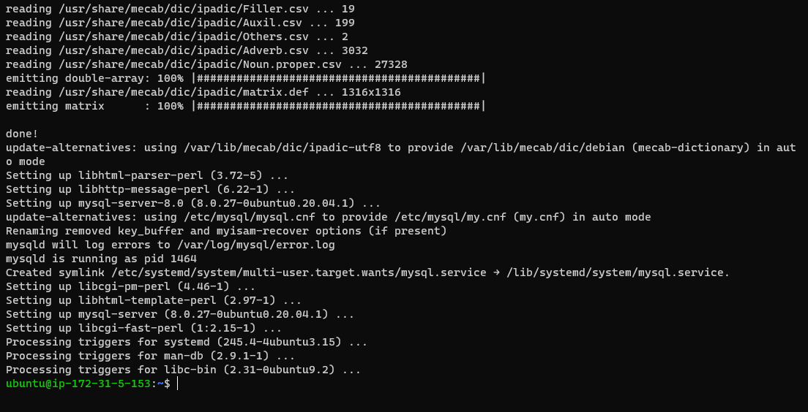


```bash
mysql_secure_installation
```
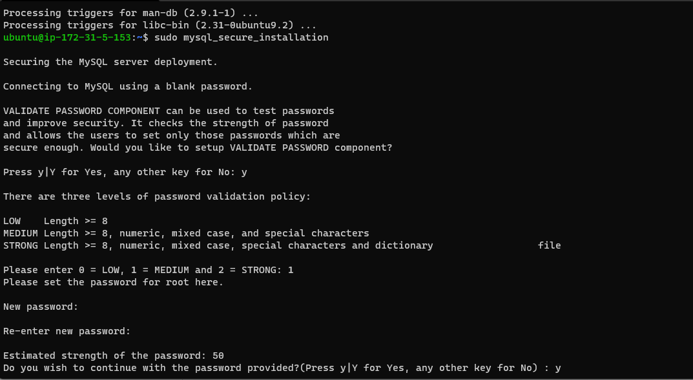

* Configuring NGINX to host our website 
A folder was created in `/var/www/` to host the website files 
```bash
sudo mkdir /var/www/projectLEMP
```
 The ownership of the directory and its file were set to the user
 ```bash
 sudo chown -R $USER:$USER /var/www/projectLEMP
```

The next step was to configure a virtual host for the ngnix server in the `/etc/nginx/sites-available` directory with the file named after the project with the following config:
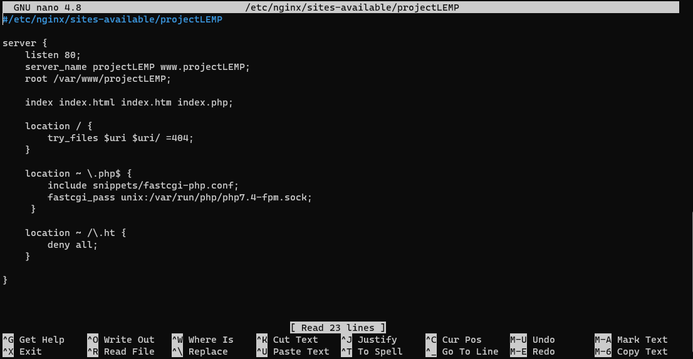

 * listen — Defines what port Nginx will listen on. In this case, it will listen on port 80, the default port for HTTP.
 * root — Defines the document root where the files served by this website are stored.
 * index — Defines in which order Nginx will prioritize index files for this website. It is a common practice to list index.html files with a higher precedence than index.php files to allow for quickly setting up a maintenance landing page in PHP applications. You can adjust these settings to better suit your application needs.
 * server_name — Defines which domain names and/or IP addresses this server block should respond for. Point this directive to your server’s domain name or public IP address.
 * location / — The first location block includes a try_files directive, which checks for the existence of files or directories matching a URI request. If Nginx cannot find the appropriate resource, it will return a 404 error.
 * location ~ \.php$ — This location block handles the actual PHP processing by pointing Nginx to the fastcgi-php.conf configuration file and the php7.4-fpm.sock file, which declares what socket is associated with php-fpm.
 * location ~ /\.ht — The last location block deals with .htaccess files, which Nginx does not process. By adding the deny all directive, if any .htaccess files happen to find their way into the document root ,they will not be served to visitors.


The virtual host was activate by linking the file in the `sites-available` directory to the website directory in `/var/www`.
```bash
sudo ln -s /etc/nginx/sites-available/projectLEMP /etc/nginx/sites-enabled/
```

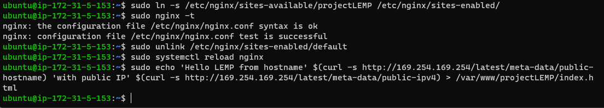
To test the effectiveness of this,
```bash 
sudo nginx -t
```
Now files hosted on the website directory can be served on the server
An index.html page was created to confirm this using the followiing command:
```bash
sudo echo 'Hello LEMP from hostname' $(curl -s http://169.254.169.254/latest/meta-data/public-hostname) 'with public IP' $(curl -s http://169.254.169.254/latest/meta-data/public-ipv4) > /var/www/projectLEMP/index.html
```
So accessing the server's address through a browser shows the content of the index.html file:

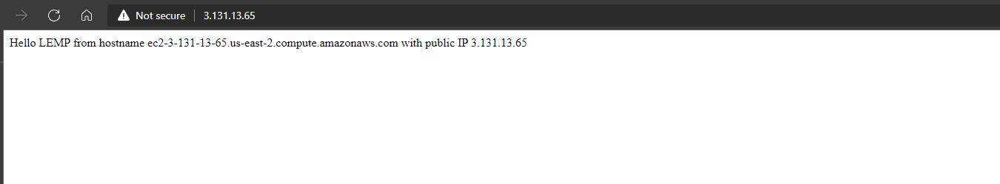

The site was also tested to confirm the ability to server php files by creating a `php.info` file in the directory. 
This file was deleted afterwards to prevent disclosure of information during enumeration.


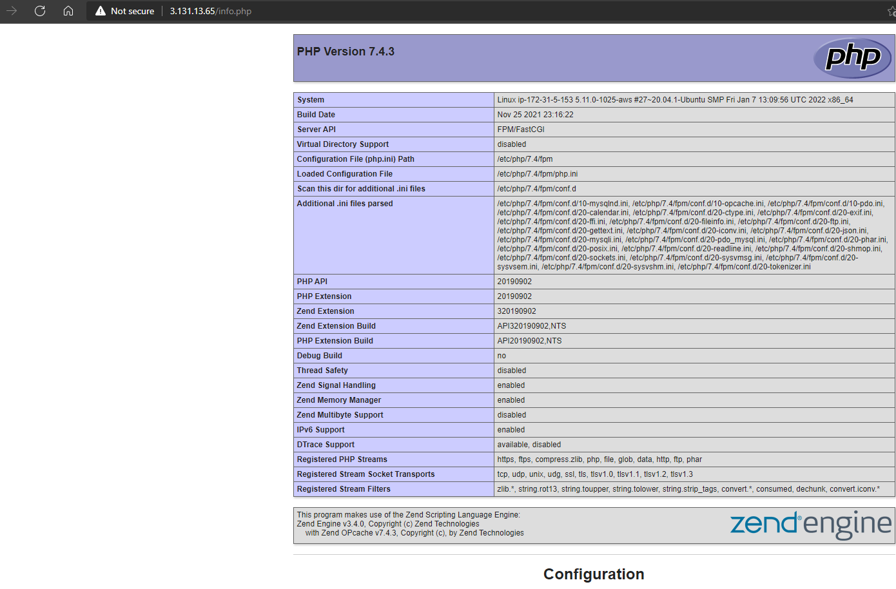
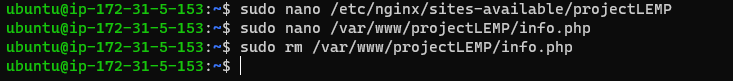

* The final step for the LEMP stack was to setup data retrieval from a MySQL database using php

A database was created:
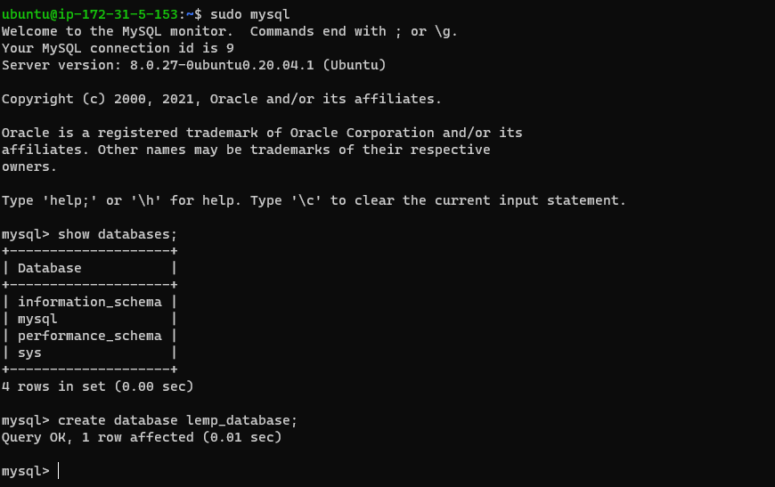

A user was also created for the management of the database:

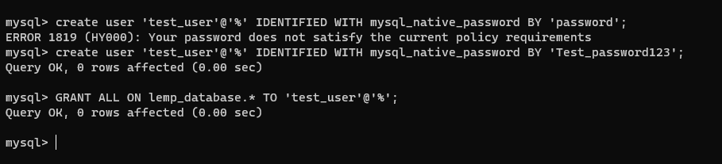
A closer look at the image above will show you how a strong password policy is enforced after the securing the mysql-server

Next, the test_user logged into the database to populate it:
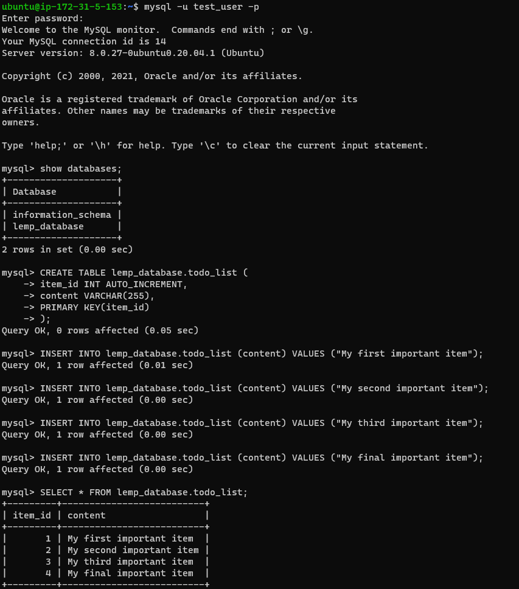

Finally, a php script was written to retrieve data from the database: 
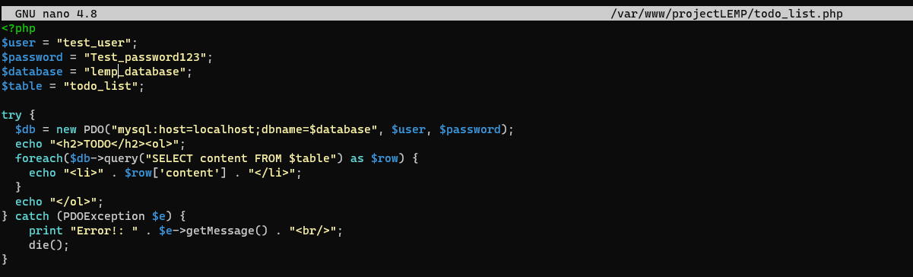

As you can see from the screenshot below, Accessing the webpage shows data pulled from the database:
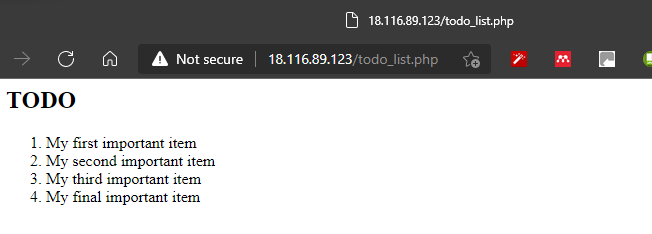