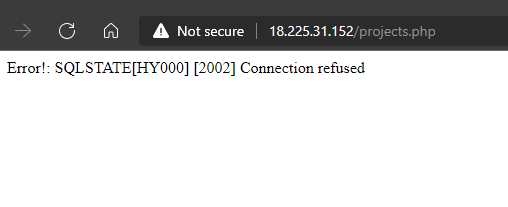
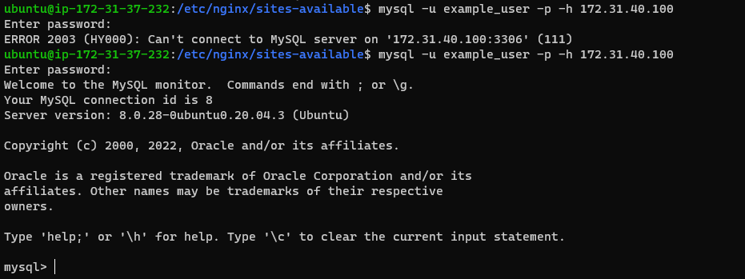

# Project 5

## Client Server Architecture
Summary: A client server architecture is a model for distributing computer applications in which a client computer
sends a request for data to a server through a network. The server accepts the request, processes it and delivers the 
response through data packets, back to the client. This architecture would be demonstrated in this project with the use 
of a client computer requesting information from a remote web server(NGINX) which in turns requests data from a remote database 
server(MySQL).

* Two Ubuntu Linux servers were created on the same local network in the cloud. They were both updated, NGINX and MySQL server were installed respectively.

```bash
sudo apt update && sudo apt upgrade -y
```


Confirmed the web server was running by checking the status of the service:
```bash
sudo systemctl status nginx
```

The following packages had to be installed to enable NGINX process PHP requests. 
Unlike Apache, NGINX needs an external program to handle PHP processing and act as a bridge between the web server and PHP interpreter.
```bash
sudo apt install php-fpm php-mysql
```

A directory was created for the web project and ownership was set for the user.
```bash
sudo mkdir /var/www/projectcsa
sudo chown -R $USER:$USER /var/www/projectcsa
```

An entry was created in NGINX sites-available directory and the contents of `projectcsa` in the corresponding code directory in this repo was put into it.
```bash 
sudo vi /etc/nginx/sites-available/projectcsa
```

Then a soft link of the file was also created in the sites-enabled directory to enable NGINX see server the webpages in the appropriate directory
```bash
sudo ln -s /etc/nginx/sites-available/projectcsa /etc/nginx/sites-enabled/
```
The nginx config was tested `sudo nginx -t` and service reloaded `sudo systemctl restart nginx`

The default page has to be unlinked otherwise the default page will persist.
```bash
sudo unlink /etc/nginx/sites-enabled/default
```

The file `info.php` was created to test the setup and deleted afterwords to prevent information disclosure.
```php
<?php
phpinfo();
```


The database installation was secured 
```bash
sudo mysql_secure_installation
```


A database was created, a new user was also created and given all privileges:
```sql
sudo mysql
mysql> CREATE DATABASE `example_database`;
mysql>  CREATE USER 'example_user'@'%' IDENTIFIED WITH mysql_native_password BY 'password';
mysql> GRANT ALL ON example_database.* TO 'example_user'@'%';
mysql> exit
mysql -u example_user -p
```


```sql
mysql> create table example_database.projects (
    -> project_id INT AUTO_INCREMENT,
    -> project_name VARCHAR(255),
    -> PRIMARY KEY(project_id)
    -> );

    mysql> INSERT INTO example_database.projects (project_name) VALUES ("Lamp Stack");
```


With the web server and database server set up, it is time to connect the application running on the web server to request information from database server.
A php script `projects.php` which can be found in the code directory corresponding with this project was written to facilitate the connection

Unfortunately, the connection was unsuccessful. This is because MYSQL be default is set to only accept local connections. A setting the configuration file has to be
changed to permit remote login.
To do this, the configuration file `/etc/mysql/my.cnf` was edited with the configuration below

```
[mysqld]
bind-address = 0.0.0.0
```
The above snippet should enable any ip address connect remotely to the mysql database, for better security, it is advisable to explicitly specify the ip addresses expected to connect
to the database server.
An attempted login from the terminal of the web server shows a successful remote connection. Now the php script should work to connect and retrieve information from the database server.


Sending a request from a web browser intiates a connection to the web server which connects with the remote database server, retrieves the information and feeds it to the web browser.


