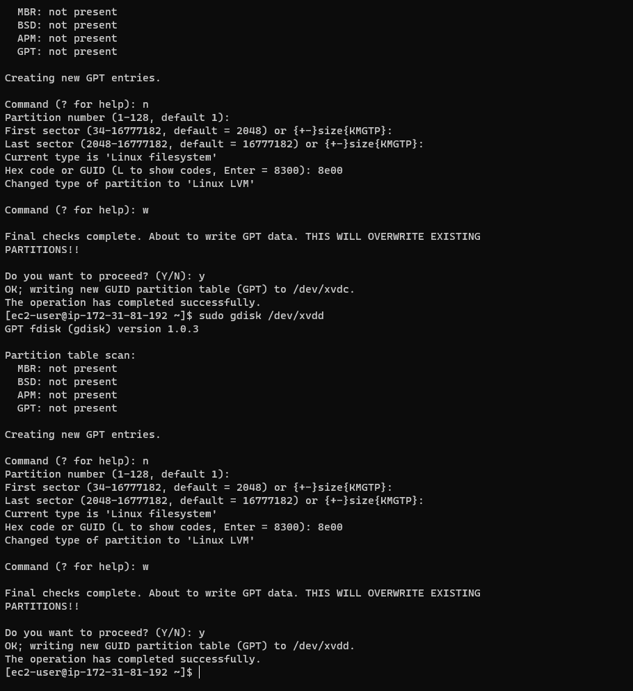
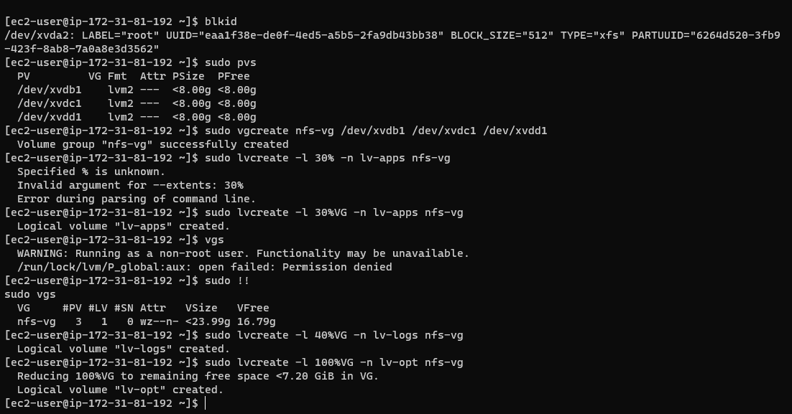
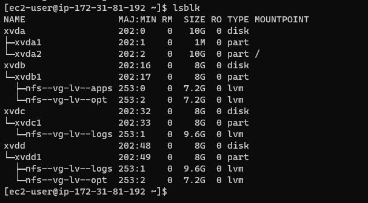
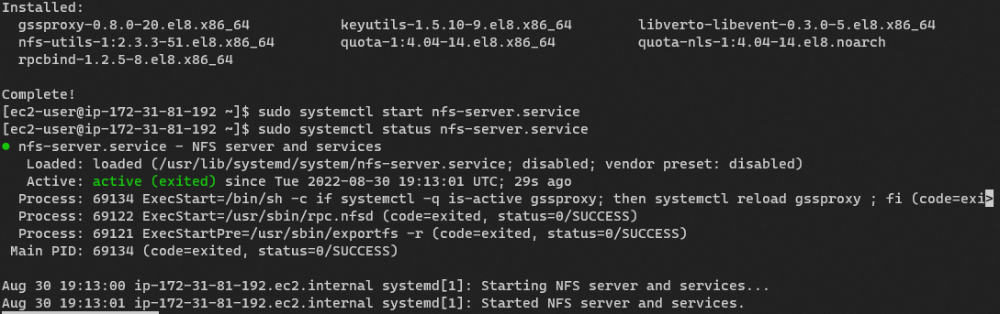

# Project 7

## Tooling Website solution 
Summary: This project shares some similarities with the previous one in the sense that the database 
server used for the previous project had to be connected to remotely. There are little differences this time around. This time, a Network File System (NFS) was used to store the files for the website and the log data. In this project a tooling website(more like ongoing development) is going to be hosted on a web server with its storage mounted on a remote Network File System (NFS) server and its database hosted on a remote database server. This will make the web server stateless so if it goes down. It can be brought back up with minimal setup.

For the NFS, a Red Hat Enteprise Linux Server was used for the project, with three disks attached to it.
To enable the NFS service, a user data script was run to prepare the environment on boot.

```bash
sudo yum -y update
sudo yum install lvm2
sudo yum install nfs-utils -y
sudo systemctl start nfs-server.service
sudo systemctl enable nfs-server.service
sudo systemctl status nfs-server.service
```
The above script installed the lvm utility which will be used for setting up logical partitions on the disks used on the NFS server and it alwso installs nfs-utils for setting up this server as a Network File Server.

After booting up, the disks were prepared for use by creating the Linux LVM partition type. 


LVM was used to configure the disks and partioned into three partitions with



There logical partitions were split across the 3 disks which wasp spread across the disks as shown in the image below.



Then the NFS server utility was installed



CentOS 8 was used for both web and database servers.

The web server was set up with the script:
```bash
#!/bin/bash
cd /etc/yum.repos.d/
sudo sed -i 's/mirrorlist/#mirrorlist/g' /etc/yum.repos.d/CentOS-*
sudo sed -i 's|#baseurl=http://mirror.centos.org|baseurl=http://vault.centos.org|g' /etc/yum.repos.d/CentOS-*
sudo yum update -y
sudo yum install -y httpd 
sudo systemctl restart httpd
sudo systemctl enable httpd
```

The database server was setup with the script:
```bash
#!/bin/bash
cd /etc/yum.repos.d/
sudo sed -i 's/mirrorlist/#mirrorlist/g' /etc/yum.repos.d/CentOS-*
sudo sed -i 's|#baseurl=http://mirror.centos.org|baseurl=http://vault.centos.org|g' /etc/yum.repos.d/CentOS-*
sudo yum update -y
sudo yum install -y mysql-server 
sudo systemctl restart mysqld
sudo systemctl enable mysqld
```


An NFS client was installed on the web servers and the database server
```bash
sudo yum install nfs-utils nfs4-acl-tools -y
```

On the web server, the web application directory `/var/www/` was mounted on the app partition on the NFS server. Similarly, the logs folder `/var/logs` was mounted on the logs partition of the NFS server


```sql
create user 'myuser'@'172.31.80.0/20' IDENTIFIED BY 'password';
```


