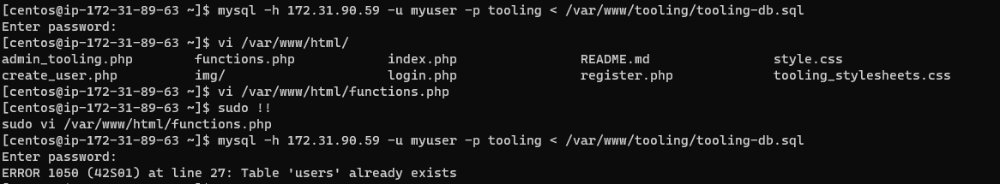

# Project 7

## Tooling Website solution 
Summary: This project shares some similarities with the previous one in the sense that the database 
server used for the previous project had to be connected to remotely. There are little differences this time around. This time, a Network File System (NFS) was used to store the files for the website and the log data. In this project a tooling website(more like ongoing development) is going to be hosted on a web server with its storage mounted on a remote Network File System (NFS) server and its database hosted on a remote database server. This will make the web server stateless so if it goes down. It can be brought back up with minimal setup.

For the NFS, a Red Hat Enteprise Linux Server was used for the project, with three disks attached to it.
To enable the NFS service, a user data script was run to prepare the environment on boot.

```bash
sudo yum -y update
sudo yum install lvm2
sudo yum install nfs-utils -y
sudo systemctl start nfs-server.service
sudo systemctl enable nfs-server.service
sudo systemctl status nfs-server.service
```
The above script installed the lvm utility which will be used for setting up logical partitions on the disks used on the NFS server and it alwso installs nfs-utils for setting up this server as a Network File Server.

After booting up, the disks were prepared for use by creating the Linux LVM partition type. 


LVM was used to configure the disks and partioned into three partitions with


There logical partitions were split across the 3 disks which were spread across the disks as shown in the image below.


And the activated


The partitions were mounted on the folders /mnt/apps, /mnt/logs, /mnt/opt. The mount point were entered into `/etc/fstab` for persistence.


The ownership on the partitions were set to NOBODY, to prevent issues with reading and writing on to the partitions


Then the NFS server utility was installed


Access was configured on the NFS for clients within the same subnet
```bash
sudo vi /etc/exports

/mnt/apps <Subnet-CIDR>(rw,sync,no_all_squash,no_root_squash)
/mnt/logs <Subnet-CIDR>(rw,sync,no_all_squash,no_root_squash)
/mnt/opt <Subnet-CIDR>(rw,sync,no_all_squash,no_root_squash)

Esc + :wq!

sudo exportfs -arv
```


CentOS 8 was used for both web and database servers.

The web server was set up with the script:
```bash
#!/bin/bash
cd /etc/yum.repos.d/
sudo sed -i 's/mirrorlist/#mirrorlist/g' /etc/yum.repos.d/CentOS-*
sudo sed -i 's|#baseurl=http://mirror.centos.org|baseurl=http://vault.centos.org|g' /etc/yum.repos.d/CentOS-*
sudo yum update -y
sudo yum install -y httpd 
sudo systemctl restart httpd
sudo systemctl enable httpd
```

The database server was setup with the script:
```bash
#!/bin/bash
cd /etc/yum.repos.d/
sudo sed -i 's/mirrorlist/#mirrorlist/g' /etc/yum.repos.d/CentOS-*
sudo sed -i 's|#baseurl=http://mirror.centos.org|baseurl=http://vault.centos.org|g' /etc/yum.repos.d/CentOS-*
sudo yum update -y
sudo yum install -y mysql-server 
sudo systemctl restart mysqld
sudo systemctl enable mysqld
```


An NFS client was installed on the web servers and the database server
```bash
sudo yum install nfs-utils nfs4-acl-tools -y
```

On the web server, the web application directory `/var/www` was mounted on the app partition on the NFS server`/mnt/apps`. Similarly, the logs folder `/var/logs` was mounted on the logs partition of the NFS server `/var/log/httpd`

It is worth nothing that mounting over an existing directory overwrites the existing contents of the directory. So the original contents were backed up before the mount operation, and the contents replaced afterwards. 
After mounting successfully, the mount details were entered into `/etc/fstab` for persistence. And tested with the command `mount -a` was used to test the configuration. 


The packages below were installed and configured to prepare the server for the tooling website

```bash
sudo dnf install https://dl.fedoraproject.org/pub/epel/epel-release-latest-8.noarch.rpm

sudo dnf install dnf-utils http://rpms.remirepo.net/enterprise/remi-release-8.rpm

sudo dnf module reset php

sudo dnf module enable php:remi-7.4

sudo dnf install php php-opcache php-gd php-curl php-mysqlnd

sudo systemctl start php-fpm

sudo systemctl enable php-fpm

setsebool -P httpd_execmem 1
```


The repository was`https://github.com/ihechiokere/tooling.git` was cloned and copied to /var/www/html

The default apache page was disabled using the command below:
```bash
sudo mv /etc/httpd/conf.d/welcome.conf /etc/httpd/conf.d/welcome.conf_backup
sudo systemctl restart httpd
```
Note: restarting the Apache service failed because logs could not be written, this was bypassed by disabling SELINUX.

```bash
sudo setenforce 0
```

Over on the MySQL server, the root account was used to create a user within the subnet using the CIDR value which made login impossible until it was changed to the subnet mask. All users created using the CIDR value were deleted by selecting the mysql database, `use mysql;` to select the database and `SELECT User, Host FROM user;` was used to view the users table and `DROP USER `myuser`@`172.31.80.0/20`;` to delete the users with CIDR domains.

The statments below were used to create an administrative user for the tooling website.

```sql
create USER 'myuser'@'172.31.80.0/255.255.240.0' IDENTIFIED BY 'password';
GRANT ALL on tooling.* TO 'myuser'@'172.31.80.0/255.255.240.0';
```


Testing the login through MySQL client on the web server was successful.


The connection string was edited in the tooling app to connect with the remote database as shown below. 


A database scrip was ran, to populate the database with the needed tables



Another admin user was added to the users table for the tooling website

```sql
INSERT INTO users 
VALUES (2, 'myuser', '5f4dcc3b5aa765d61d8327deb882cf99', 'user@mail.com', 'admin', '1');
```


And this user was used to login to the tooling website hosted on all web servers.


